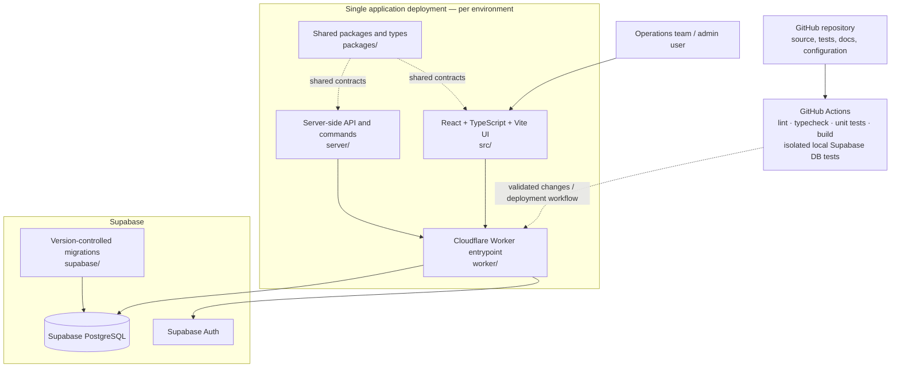
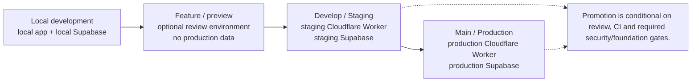
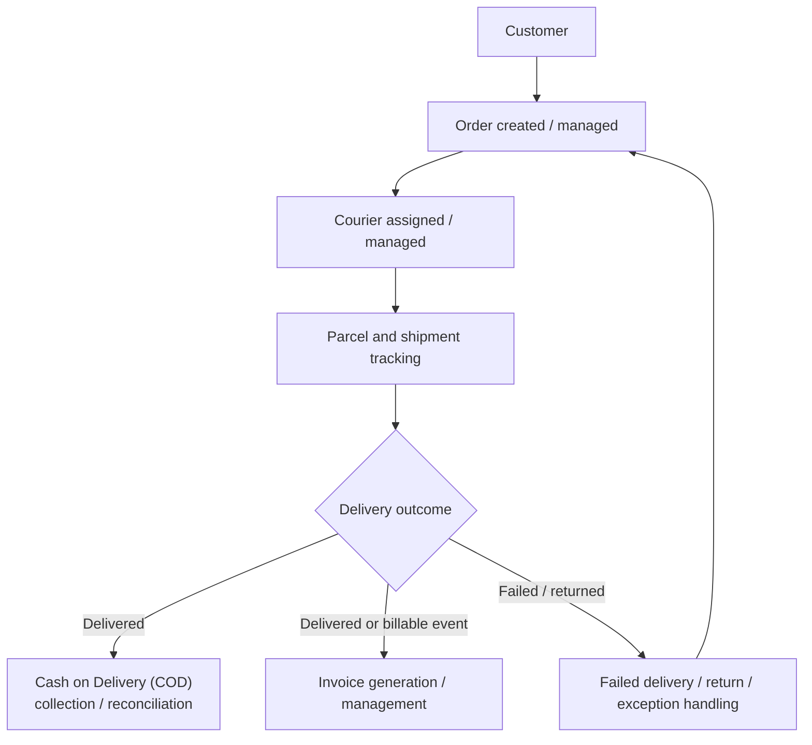
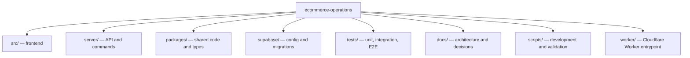

# E-Commerce Operations — Architecture Diagrams

These diagrams use Mermaid, which GitHub renders directly in Markdown.

## 1. Application and infrastructure

This diagram reflects the architecture documented in the repository README: one React + TypeScript + Vite application deployed as a Cloudflare Worker per environment. The Worker serves the UI and server-side API layer; Supabase provides PostgreSQL and Auth. This is not a microservices architecture.

## 2. Environment separation

The arrows represent the intended promotion path, not a claim that every deployment is fully automated.

## 3. Operational domain flow (high-level)

This is a conceptual view of the e-commerce operations lifecycle, based on the project’s known Orders, Customers, Parcels, Invoices, COD and Courier workstreams. Confirm individual transitions and database relationships against the current implementation before using this as a formal process specification.

## 4. Repository map

## Security and architecture notes

- Keep production secrets out of source control.
- Never expose Supabase service-role or secret keys to the browser.
- Database access policies and Row Level Security (RLS) should be explicit in version-controlled migrations.
- Keep staging and production data environments separate.
- This document is a navigable architecture overview, not a substitute for the locked MVP Blueprint, Master Implementation Plan v4.0 FINAL, or verified schema/API contracts.
